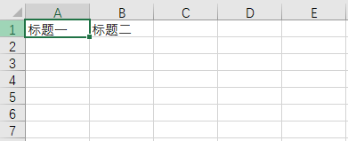
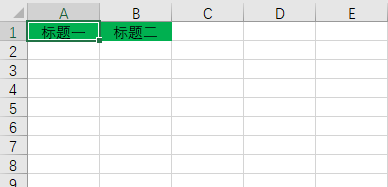
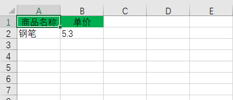
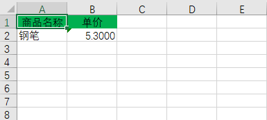

# Colipu.Extensions.Excel

## 简单使用

### 生成一个全新的`Excel`
```csharp
//具有两列
var excelTable = new ExcelTable("标题一", "标题二");
//默认生成HSSFWorkbook(97-2003)格式Excel
var bytes =  ExcelExtension.CreateWorkbook().AddData(excelTable).ToBytes();
```


### 填充标题样式
```csharp
//具有两列
var excelTable = new ExcelTable("标题一", "标题二");
excelTable.TitleStyleAction = (style) =>
{
    //水平居中
    style.Alignment = HorizontalAlignment.Center;
    //设置前景色为绿色
    style.FillForegroundColor = HSSFColor.Green.Index;
    //填充样式
    style.FillPattern = FillPattern.SolidForeground;
};
//默认生成HSSFWorkbook(97-2003)格式Excel
var bytes =  ExcelExtension.CreateWorkbook().AddData(excelTable).ToBytes();
```


### 填充列数据
```csharp
var excelTable = new ExcelTable("商品名称", "单价");
excelTable.TitleStyleAction = (style) =>
{
    //水平居中
    style.Alignment = HorizontalAlignment.Center;
    //设置前景色为绿色
    style.FillForegroundColor = HSSFColor.Green.Index;
    //填充样式
    style.FillPattern = FillPattern.SolidForeground;
};
excelTable.Add("钢笔", 5.3M);
//默认生成HSSFWorkbook(97-2003)格式Excel
var bytes =  ExcelExtension.CreateWorkbook().AddData(excelTable).ToBytes();
```


### 自定义列样式
```csharp
//在标题行设置每个列的样式
var excelTable = new ExcelTable("商品名称", new CellStyle
{
    //设置如何格式化传入的数据
    Format = (value) =>
    {
        return ((decimal)value).ToString("0.0000");
    },
    //设置列样式, 此样式会应用于除了标题行之外的整列
    Style = (cellStyle) =>
    {
        cellStyle.Alignment = HorizontalAlignment.Right;
    },
    //列标题
    TitleValue = "单价"
});
excelTable.TitleStyleAction = (style) =>
{
    //水平居中
    style.Alignment = HorizontalAlignment.Center;
    //设置前景色为绿色
    style.FillForegroundColor = HSSFColor.Green.Index;
    //填充样式
    style.FillPattern = FillPattern.SolidForeground;
};
excelTable.Add("钢笔", 5.3M);
//默认生成HSSFWorkbook(97-2003)格式Excel
var bytes =  ExcelExtension.CreateWorkbook().AddData(excelTable).ToBytes();
```


## 进阶使用
### 设置全局默认样式
一般来说一个系统的导出风格很可能都是一致的，例如所有涉及到金额类型的都保留4为小数并居右展示，这时则需要在一个地方统一设置
```csharp
//默认设置标题列样式
ExcelExtension.ConfigurationTitleCellStyle((cellStyle) =>
{
    cellStyle.FillForegroundColor = HSSFColor.Green.Index;
    cellStyle.FillPattern = FillPattern.SolidForeground;
    cellStyle.Alignment = HorizontalAlignment.Center;
});
//设置类型与样式的映射关系
ExcelExtension.ConfigurationCellStyle(new Dictionary<Type, Action<ICellStyle>>
{
    { typeof(decimal), (cellStyle) => { cellStyle.Alignment = HorizontalAlignment.Right; /*所有decimal类型的数据样式居右*/ } }
});
//设置类型如何格式化为字符串
ExcelExtension.ConfigurationCellValueFormat(new Dictionary<Type, Func<object, string>>
{
    { typeof(decimal), (value) => { return ((decimal)value).ToString("0.0000"); /*所有decimal类型的数据格式化为保留4位小数*/ } }
});
```
设置之后，没有设置自定义样式的地方则会使用默认样式，如果定义了自定义样式，则会被自定义样式替换。
```csharp
var excelTable = new ExcelTable("商品名称", "单价");
excelTable.Add("钢笔", 5.3M);
//默认生成HSSFWorkbook(97-2003)格式Excel
var bytes =  ExcelExtension.CreateWorkbook().AddData(excelTable).ToBytes();
```
